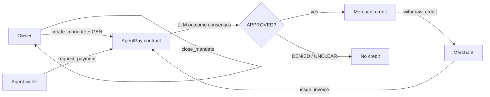

# AgentPay

Purpose-gated spending mandates on [GenLayer](https://docs.genlayer.com/) Studio Next.

An owner freezes a budget, an authorized agent wallet, an allowlisted merchant, a per-payment cap, and a **natural-language purpose**. The merchant invoices. The agent wallet asks the contract to pay. Validators run an LLM judgment (`APPROVED` / `DENIED` / `UNCLEAR`) and must agree on the outcome. Only `APPROVED` creates merchant **credit**. Native GEN moves later, when the merchant withdraws or the owner closes the mandate.

Studio Next GEN in this repository is a **test token**. It has no real-world monetary value.

**Live demo: pending Vercel deployment.** There is no public app URL in this submission. Source, explorer, and on-chain reads work without a wallet.

| Reviewer doc | What it contains |
| --- | --- |
| **[docs/REVIEWER_EVIDENCE.md](docs/REVIEWER_EVIDENCE.md)** | Product-contract transactions, independently re-read on 2026-10-09 |
| [docs/EVIDENCE_MATRIX.md](docs/EVIDENCE_MATRIX.md) | Negative cases on **fresh gltest fixtures** and mocked direct-mode tests |
| [docs/CONTRACT_INTERFACE.md](docs/CONTRACT_INTERFACE.md) | Methods, roles, settlement rules, failed `SettlementProbe` |
| [docs/REVIEWER_DEMO.md](docs/REVIEWER_DEMO.md) | Three-wallet reproduction script |
| [docs/VERCEL.md](docs/VERCEL.md) | Vercel Root Directory `frontend` and public env names |

---

## The problem

AI agents will spend. A hardcoded allowlist cannot describe “GPU hours for this experiment, and not domain names or personal subscriptions.” Ordinary smart contracts cannot judge that sentence. AgentPay freezes the purpose on-chain and asks GenLayer validators to decide whether a specific invoice fits.

An **agent** in this product is an **authorized wallet** named in the mandate. This repository does not ship an autonomous agent service.

## Why GenLayer

- The purpose is natural language, not a boolean predicate.
- `request_payment` runs `gl.vm.run_nondet` so a leader proposes `APPROVED` / `DENIED` / `UNCLEAR` and validators agree on the **outcome** (reason text is allowed to differ).
- Credit, remaining budget, and native payouts are deterministic around that judgment.

## Roles

| Role | What it may do |
| --- | --- |
| **Owner** | `create_mandate` (payable budget) and `close_mandate` (refund uncommitted remaining budget) |
| **Authorized agent wallet** | `request_payment` for invoices on that mandate |
| **Allowlisted merchant** | `issue_invoice` and `withdraw_credit` of its own credit |

Other callers revert. IDs are caller-supplied and rejected if reused.

## Five-step flow

1. **Fund mandate** — owner deposits test GEN and freezes purpose, agent, merchants, cap, expiry.
2. **Invoice** — allowlisted merchant records purpose and amount. No funds move.
3. **Purpose decision** — agent wallet calls `request_payment`. `APPROVED` moves budget into merchant credit. `DENIED` / `UNCLEAR` consume the invoice and credit nothing.
4. **Merchant withdrawal** — merchant calls `withdraw_credit`. Native GEN is sent on the EOA `emit_transfer` path. Credit is not “paid” until that transfer exists.
5. **Owner refund** — owner calls `close_mandate` and receives remaining uncommitted budget. Leftover merchant credit is not swept.




Localhost UI captured 2026-10-07 against Studio Next. Test GEN only. This is not a Vercel deployment. Files named `*-m-demo.png`, `*-i-demo.png`, `*-d-demo.png` and screens under `docs/review-c-screens/` are **design-demo / review fixtures**, not live product-contract pages.

---

## Network and product contract

| Item | Value |
| --- | --- |
| Network | GenLayer Studio Next |
| Chain ID | `61997` |
| RPC | `https://studio-next.genlayer.com/api` |
| Explorer | [explorer-studio-dev.genlayer.com](https://explorer-studio-dev.genlayer.com/) |
| Product contract | [`0x754E97a763ed0Ae12da496A68d7a47090F3f1c2F`](https://explorer-studio-dev.genlayer.com/address/0x754E97a763ed0Ae12da496A68d7a47090F3f1c2F) |
| Deploy transaction | [`0xba9ba2fede114329de64f71698c5f71066b52376cf4b1df81cf5084c01de8fc3`](https://explorer-studio-dev.genlayer.com/tx/0xba9ba2fede114329de64f71698c5f71066b52376cf4b1df81cf5084c01de8fc3) |
| Deployer | `0xb594bca7F432Fd660CAe236b8b9908a0B731260A` |
| Runner | `py-genlayer:5jycge4q8k23462jtb0b9fyey1s9qz928sz2nbrd9mg4sxqg2qng` |
| GitHub | [github.com/edwarderlick/agentpay](https://github.com/edwarderlick/agentpay) |
| **Live demo** | **Pending Vercel deployment** |
| SDKs | `genlayer-js` `2.0.0-rc.1`, Transaction Kit RC2 `0.1.0-rc.2` |

Studionet (`61999`) is unused. Probe contracts and `gltest` fixtures are blocked in the frontend (`isContractReady()`).

---

## Verify it yourself (no wallet)

These links are public. The Studio Next explorer method column often prints `(constructor)` for every call; method names below come from RPC `calldata.readable` and `readContract` views, recorded in [docs/REVIEWER_EVIDENCE.md](docs/REVIEWER_EVIDENCE.md).

| What | Link |
| --- | --- |
| Product contract | [0x754E97a7…1c2F](https://explorer-studio-dev.genlayer.com/address/0x754E97a763ed0Ae12da496A68d7a47090F3f1c2F) |
| Deploy | [0xba9ba2fe…8fc3](https://explorer-studio-dev.genlayer.com/tx/0xba9ba2fede114329de64f71698c5f71066b52376cf4b1df81cf5084c01de8fc3) |
| Create + deposit `m-a56f4429378650ae158a` | [0xce0221d8…6491](https://explorer-studio-dev.genlayer.com/tx/0xce0221d8dea2fb3dc493bca2b3c9bc09e8be9ca7923180223d825d7aef3c6491) |
| Invoice `inv-65221573143df782cccc` | [0x04f20849…a8a5](https://explorer-studio-dev.genlayer.com/tx/0x04f20849717809aafa766fa9d99195bc3c90fd3898d20927ca070bb1782ba8a5) |
| `request_payment` `req-164bd8f45936ae77b467` (`APPROVED`) | [0x47f924b9…7e79](https://explorer-studio-dev.genlayer.com/tx/0x47f924b95f93e0c72b70ca5dc2c33072f143b2ad76cbc9cf7b5454c8a2047e79) |
| Merchant withdraw 0.005 GEN (parent) | [0x063ea623…1736](https://explorer-studio-dev.genlayer.com/tx/0x063ea623194c0849c1ab8a89217458c84da37f5a05a2ef5636a032b1fb931736) |
| Native send to merchant | [0x2bb58c62…5163](https://explorer-studio-dev.genlayer.com/tx/0x2bb58c62b1d0a90223c2661065227b4ccc01a213c0645a35434aff02b44e5163) |
| Owner close / refund 0.01 GEN (parent) | [0x57695d07…c550](https://explorer-studio-dev.genlayer.com/tx/0x57695d077086023b0493d98d13ef99b48f9a3ec01de5c9fb779b4d22ad99c550) |
| Native refund to owner | [0x18d475b4…cecb](https://explorer-studio-dev.genlayer.com/tx/0x18d475b4f6826ab416b450ad7c6d9f1b84f5b7a960d4371de328aeb201cbcecb) |
| Second merchant withdraw 0.005 GEN | [0xacc2665c…3fbb](https://explorer-studio-dev.genlayer.com/tx/0xacc2665cd10a94533dc8e2cd14b37674218b5dc4dc783efb705c082ccab93fbb) |
| Create + deposit `m-c690fd8825e402e54f11` (1 GEN, still active) | [0x812b29d0…88d5](https://explorer-studio-dev.genlayer.com/tx/0x812b29d0f72c40bf317cb7005ef52482a93f03fb121321f3771988c933c688d5) |

Public app routes exist in this repo (`/mandates/[id]`, `/invoices/[id]`, `/decisions/[id]`). They will be reachable on Vercel after deploy. Until then, use the explorer rows above, or run the frontend locally.

**Product vs fixtures.** Every hash in the table targets `0x754E97a7…1c2F`. DENIED / UNCLEAR / injection / revert cases in [docs/EVIDENCE_MATRIX.md](docs/EVIDENCE_MATRIX.md) used **new** `gltest` contracts. Those fixture addresses and hashes are not product-contract activity.

---

## Settlement (read this)

`APPROVED` creates **merchant credit**. It is not a native payout. A finalized parent with `SUCCESS` is not payment by itself.

Native delivery on the product contract is recorded as:

1. Parent write `FINISHED_WITH_RETURN` / leader `SUCCESS`.
2. Leader pending transfer with `is_eth_send: true` to the recipient for the withdrawn amount.
3. A value-bearing follow-up transaction from the contract to that recipient for the same amount.

How those product payouts were proven, including the failed `SettlementProbe` (`gl.chain.Account.emit_transfer` does **not** deliver), is in [docs/REVIEWER_EVIDENCE.md](docs/REVIEWER_EVIDENCE.md#settlement) and [docs/CONTRACT_INTERFACE.md](docs/CONTRACT_INTERFACE.md).

---

## Architecture

| Piece | Role |
| --- | --- |
| `contracts/agentpay.py` | Product intelligent contract (5 writes, 19 views, `PAGE_MAX` 50) |
| `contracts/eoa_transfer_probe.py` | Proven EOA `_Recipient.emit_transfer(value=int)` probe |
| `contracts/settlement_probe.py` | **Failed** `gl.chain.Account.emit_transfer` evidence (kept on purpose) |
| `frontend/` | Next.js 16 app, Transaction Kit RC2 writes, EIP-6963 + optional WalletConnect |
| `tests/direct/` | In-memory pytest, mocked LLM |
| `tests/integration/` | Studio Next `gltest` (`--network studio_devnet`) |
| `frontend/fee-profile.json` | Measured 2026-10-07T09:03:26Z; `withdraw_credit` / `close_mandate` include `totalMessageFees` |

Writes: `create_mandate`, `issue_invoice`, `request_payment`, `withdraw_credit`, `close_mandate`. Full method table: [docs/CONTRACT_INTERFACE.md](docs/CONTRACT_INTERFACE.md).

**Fees.** Message-emitting methods need a message-fee allocation. Early product `withdraw_credit` / `close_mandate` calls reverted with `Mode1MessageFeesRequireGenVMPerEmissionSupport` until the measured fee profile was used. Those failed hashes are labeled in the evidence doc.

**Pagination.** List views take `(offset, limit)` and return `{ids,total,offset,limit,has_more}`.

**Wallets.** Injected EIP-6963 wallets that announce on Studio Next work. WalletConnect needs `NEXT_PUBLIC_WALLETCONNECT_PROJECT_ID` at build time. Compatibility is not universal.

### Honest limits

- No audit, no mainnet, no real-money payments.
- No live Vercel demo in this submission.
- No autonomous agent runtime.
- Studio Next can return `gen_call` `-32006` (server busy); views retry.
- Explorer UI labels are unreliable; use RPC calldata and contract views.
- Native child sends often show execution `NOT_VOTED` / `NO_MAJORITY`; the parent plus `is_eth_send` plus the value-bearing child are the transfer record.

---

## Reproduce locally

Repository root is this directory (the Git root). Node 20+ / 22, Python 3.12, a project venv.

```shell
npm ci
npm test --workspace frontend
npm run lint --workspace frontend
npm run build
```

`frontend` `npm run lint` is `tsc --noEmit`. `npm run build` is `next build --webpack`.

Contract lint and direct tests, pin GenVM **v0.6.0-rc8** so the runner `py-genlayer:5jycge4q8k23462jtb0b9fyey1s9qz928sz2nbrd9mg4sxqg2qng` is present:

```shell
python -m venv .venv
.venv\Scripts\Activate.ps1   # Windows; on Unix: source .venv/bin/activate
pip install -r requirements.txt
$env:GENVM_VERSION='v0.6.0-rc8'          # Unix: export GENVM_VERSION=v0.6.0-rc8
$env:GENVM_ALLOW_PRERELEASE='1'
genvm-lint check contracts/agentpay.py --json
python -m pytest tests/direct/ -v
```

Studio Next integration tests spend **test GEN** for fees and mandate budgets. From this directory, run **one** `-k` name per invocation on Windows:

```shell
gltest tests/integration/test_agentpay.py -k test_studio_next_denied_invoice -v -s --network studio_devnet
```

Do not point `gltest` at localnet (`127.0.0.1:4000`) for this evidence. Cases and fixture JSON: [docs/EVIDENCE_MATRIX.md](docs/EVIDENCE_MATRIX.md).

Frontend env: copy `frontend/.env.example` to `frontend/.env`. Set `NEXT_PUBLIC_CONTRACT_ADDRESS` to `0x754E97a763ed0Ae12da496A68d7a47090F3f1c2F`. Leave WalletConnect empty unless you have a Reown project ID.

Vercel: Root Directory **`frontend`**. Public env names are in [docs/VERCEL.md](docs/VERCEL.md). Do not commit `.env` files.

Three-wallet walkthrough: [docs/REVIEWER_DEMO.md](docs/REVIEWER_DEMO.md).

CI on `main`: `.github/workflows/ci.yml` (lint + `pytest tests/direct/`) and `.github/workflows/frontend.yml` (`npm ci`, typecheck, vitest, webpack production build).

Last local gate (2026-10-09): `pytest tests/direct/` **62 passed**; frontend vitest **22 files / 159 tests**; `tsc --noEmit` clean; `next build --webpack` (Next 16.0.3) succeeded; `genvm-lint` ok for `agentpay.py`, `eoa_transfer_probe.py`, and `settlement_probe.py`.

## Built from

AgentPay started from [`genlayerlabs/genlayer-project-boilerplate`](https://github.com/genlayerlabs/genlayer-project-boilerplate) at `v2-dev` (`816f3b88175032f10242e278c0d13d75f185c882`). The GenLayer CLI, contract layout, frontend workspace, and MIT license text in [LICENSE](LICENSE) (Copyright (c) 2024 YeagerAI) come from that upstream project.

This GitHub repository’s published history begins with the AgentPay product release. It does not replay the boilerplate’s earlier commits. AgentPay application code, Studio Next evidence, and the product contract are maintained here; reused boilerplate files keep their upstream license and attribution.

## License

MIT. See [LICENSE](LICENSE).
